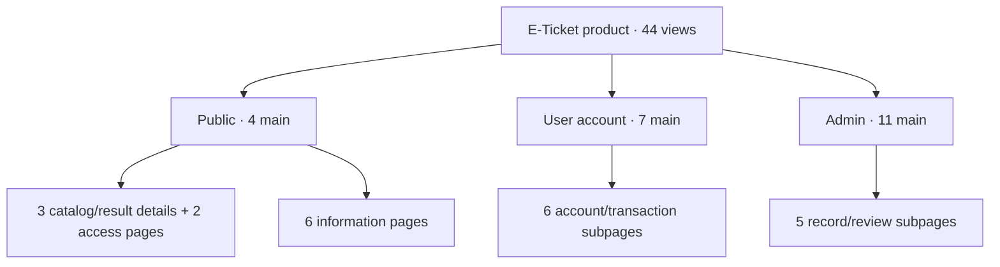

# E-Ticket site architecture — decision before UI implementation

Status: **proposed screen inventory for the complete product UI**. All 44
product view routes now serve v2-styled shells as of 2026-09-29. Route coverage
does not mean all views are functionally complete: approved policy text is not
supplied; several admin detail/editor workflows are read-only or queue-limited.
This fixes the number and hierarchy of views before redesigning application templates.
It is based on `PROJECT_BLUEPRINT.md`, the current web route map and the v2
design handoff. It does not claim that proposed routes or backend operations
already exist.

## Count and definitions

| Type | Public | Signed-in user | Admin | Total |
|---|---:|---:|---:|---:|
| Main pages — primary destinations | 4 | 7 | 11 | **22** |
| Subpages — access, detail or workflow views | 5 | 6 | 5 | **16** |
| Information pages — explanatory/policy content | 6 | 0 | 0 | **6** |
| **Total screen views** | **15** | **13** | **16** | **44** |

One view is not necessarily one HTML file: list/detail views can share a
component and a route parameter. Loading, empty, validation, permission-denied
and error states are **variants**, not extra page counts. The development-only
`/payment-demo` is excluded. All 44 proposed product routes now have a web
shell (22 main, 16 subpages and 6 information pages); **0 view routes remain
unmapped**. A served shell does not certify backend, policy or provider
readiness.

## Sitemap overview

## Main pages — 22

An existing route is a working page shell today, **not** approval to call the
new UI done. Planned routes are proposed UI structure, not implemented code.

| ID | Area | Page label | Proposed route | Route now |
|---|---|---|---|---|
| P01 | Public | Home / Explore | `/` | Existing |
| P02 | Public | Ticket series | `/series` | Existing |
| P03 | Public | Packages | `/packages` | Existing |
| P04 | Public | Results | `/results` | Existing |
| U01 | User | Dashboard | `/dashboard` | Existing |
| U02 | User | My tickets | `/tickets` | Existing |
| U03 | User | Orders | `/orders` | Existing |
| U04 | User | Payments | `/payments` | Existing |
| U05 | User | Wallet | `/wallet` | Existing |
| U06 | User | Withdrawals | `/withdrawals` | Existing |
| U07 | User | Rewards & referrals | `/referrals` | Existing; label changes |
| A01 | Admin | Overview | `/admin` | Existing |
| A02 | Admin | Users | `/admin/users` | Existing bounded masked read view |
| A03 | Admin | Ticket series | `/admin/series` | Existing |
| A04 | Admin | Packages | `/admin/packages` | Existing admin catalog read view |
| A05 | Admin | Draws & results | `/admin/draws` | Existing read-only shell |
| A06 | Admin | Payments | `/admin/payments` | Existing |
| A07 | Admin | Withdrawals & P2P | `/admin/withdrawals` | Existing; label broadens |
| A08 | Admin | Disputes & refunds | `/admin/disputes` | Existing; label broadens |
| A09 | Admin | Revenue | `/admin/revenue` | Existing |
| A10 | Admin | Marketing | `/admin/marketing` | Existing |
| A11 | Admin | Audit | `/admin/audit` | Existing bounded read view |

## Subpages — 16

| ID | Parent | View | Proposed route | Route now |
|---|---|---|---|---|
| S01 | Public series | Series detail | `/series/{id}` | Existing |
| S02 | Public packages | Package detail | `/packages/{id}` | Existing |
| S03 | Public results | Published result & proof | `/results/{series_id}` | Existing |
| S04 | Account access | Sign in | `/login` | Existing |
| S05 | Account access | Sign up | `/register` | Existing |
| S06 | Purchase | Checkout: review → method → status | `/checkout` | Existing; one route with steps |
| S07 | User orders | Order & payment status | `/orders/{id}` | Existing |
| S08 | User tickets | Ticket detail | `/tickets/{id}` | Existing owner-scoped read view |
| S09 | User withdrawals | Withdrawal timeline | `/withdrawals/{id}` | Existing owner-scoped read view |
| S10 | Account utility | Profile & verified destination display | `/account` | Existing; no self-verification flow |
| S11 | Account utility | Notifications | `/notifications` | Existing delivered-event read view |
| S12 | Admin users | User record | `/admin/users/{id}` | Existing masked read view |
| S13 | Admin catalog | Series/package editor | `/admin/catalog/{kind}/{id}` | Existing read-only record; editor not built |
| S14 | Admin draws | Draw lifecycle & proof | `/admin/draws/{id}` | Existing read-only record |
| S15 | Admin payments | Payment/reconciliation case | `/admin/payments/{id}` | Existing queue-limited read view; no UTR-only approval |
| S16 | Admin disputes | Dispute/refund case | `/admin/disputes/{id}` | Existing list-backed read view; case is not payout |

The admin detail routes describe review surfaces. They do not grant mutation
rights: backend role, evidence, state transition and audit checks remain
authoritative. A payment claim or receiver confirmation never becomes a paid
order by UI action alone.

## Information pages — 6

These six are explicitly named in the original public-page blueprint. They
are **content slots**, not approved policy wording. Do not invent legal or
provider promises. Show only configured payment methods on the methods page.

| ID | Page | Proposed route | Content owner/status |
|---|---|---|---|
| I01 | How it works | `/how-it-works` | Product-flow explainer implemented |
| I02 | Payment methods | `/payment-methods` | Configuration-aware guide implemented |
| I03 | Terms | `/terms` | Shell exists; owner-approved text required |
| I04 | Privacy | `/privacy` | Shell exists; owner-approved text required |
| I05 | Refund policy | `/refund-policy` | Shell exists; owner-approved text required |
| I06 | Responsible use | `/responsible-use` | Shell exists; owner-approved text required |

## Navigation

- Public desktop top bar: **Explore, Series, Packages, Results, How it works**;
  Sign in/account is a utility action. Footer carries all six information
  pages. Mobile uses a compact menu for the same items, not a hidden checkout.
- Signed-in desktop sidebar: **Dashboard, Tickets, Orders, Payments, Wallet,
  Withdrawals, Rewards**. Account and Notifications are utility items. Mobile
  bottom navigation keeps **Home, Tickets, Orders, Wallet, More**; More contains
  Payments, Withdrawals, Rewards, Account and Notifications.
- Admin desktop sidebar has five groups: **Overview; People** (Users);
  **Catalog** (Series, Packages, Draws); **Operations** (Payments,
  Withdrawals, Disputes); **Business** (Revenue, Marketing, Audit). Mobile
  collapses groups into a menu and keeps record details full-screen.
- Detail pages show a breadcrumb/back link to their parent. Status is always
  textual and sourced from the server; colors are secondary cues.

## What is not a page

Payment-provider popovers, coupon validation, package filters, confirmation
dialogs, empty/loading/error states and admin table filters are components or
states of the pages above. The scratch-card look is decorative ticket styling,
not a client-side reveal or winner-selection feature. A standalone payment
demo remains development-only and is not included in product navigation.

## Validation and build order

Before creating screens, verify these five findability paths with a quick
tree test: (1) find an active package and review its price; (2) check a
published result proof; (3) locate an order's payment status; (4) see a
withdrawal hold/timeline; (5) locate an admin dispute without suggesting an
automatic release. Expected paths are Packages → Package detail → Checkout;
Results → Result proof; Orders → Order detail; Withdrawals → Withdrawal
timeline; Operations → Disputes → Case. If a person cannot find a destination,
adjust labels/grouping before implementing 44 screens.

Build in this order after the architecture is accepted: public/auth/catalog;
user dashboard, tickets and orders; checkout/payments/wallet/withdrawals;
admin operations and reporting; then the six information pages with supplied
content. Validate desktop/mobile and real API states per group. The existing
nine-screen board is an **overview**, not forty-four finished screen designs.
